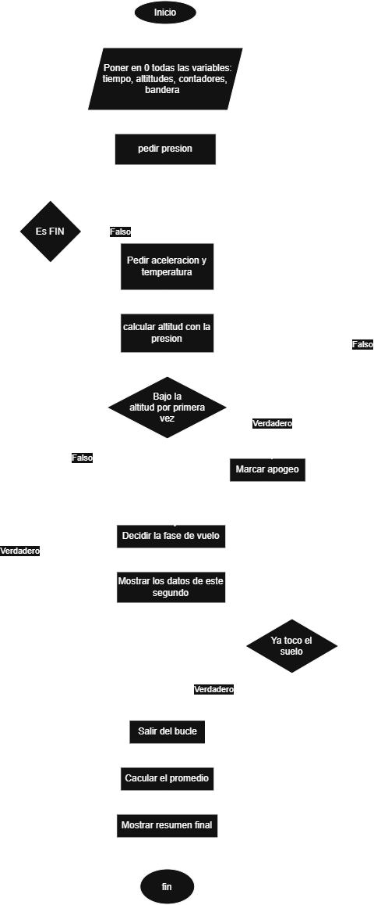

funcion calcular_altitud(presion_hpa)  
    altitud = 44330 * (1 - (presion_hpa / 1013.25) ^ 0.1903)  
    devolver altitud  
fin funcion  

 ---
 
funcion determinar_estado_vuelo(altitud_actual, altitud_previa, aceleracion)  
    si altitud_actual > altitud_previa entonces  
        estado = "Ascenso"  
    sino  
        si altitud_actual <= 500 o aceleracion <= -15 entonces  
            estado = "Despliegue de Paracaidas"  
        sino  
            estado = "Apogeo / Caida libre"  
        fin si  
    fin si  
    devolver estado  
fin funcion  

---

  funcion evaluar_alerta_temperatura(temp_celsius)  
    si temp_celsius >= 80 entonces  
        devolver verdadero  
    sino  
        devolver falso  
  
fin si  
fin funcion  

## Diagrama de flujo

